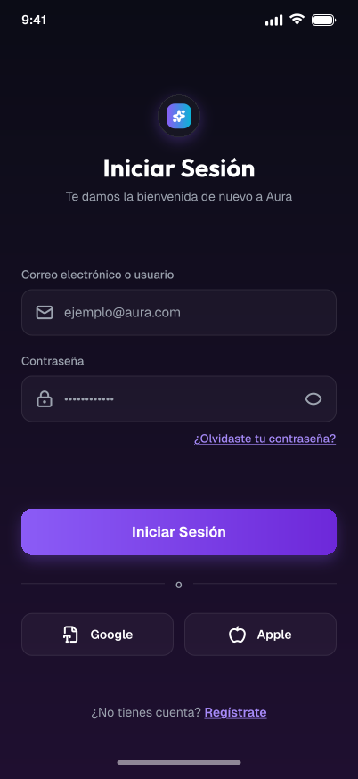
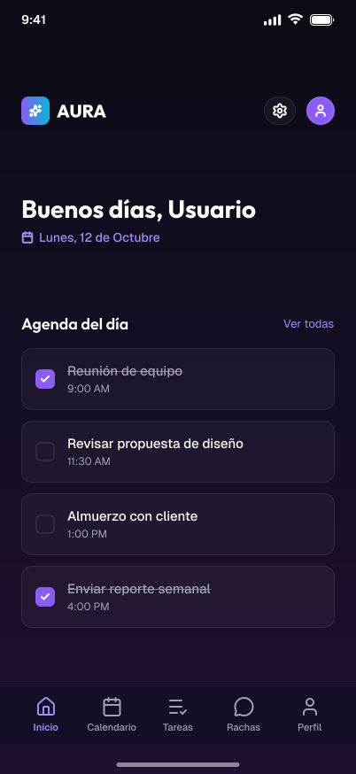
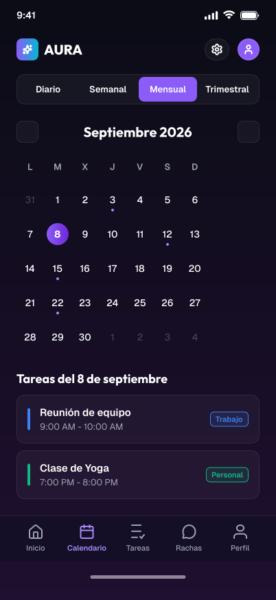
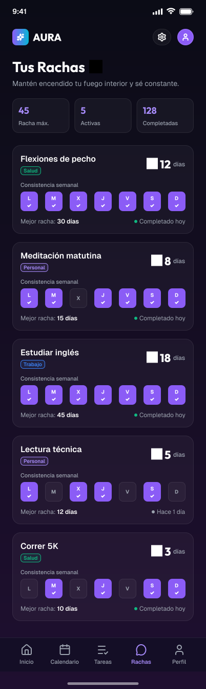

# Agenda

[](https://github.com/daviddglL/agenda/actions/workflows/ci.yml)

App de agenda y tareas con **rachas**, hecha con **Kotlin Multiplatform** (Android + iOS) y un
**backend propio en Ktor**. Funciona sin conexión (offline-first), sincroniza en tiempo real y
manda recordatorios push.

<p align="center">
  
  
  
  
</p>

## Funcionalidades

- Registro, login con JWT (con refresco automático de token) y recuperación de contraseña por email con código de un solo uso.
- Tareas con categoría, prioridad, repeticiones y recordatorios; edición, borrado individual y en bloque, buscador y filtros.
- Calendario mensual con las tareas de cada día.
- Rachas: días seguidos con al menos una tarea completada, racha actual y mejor racha.
- Offline-first: Room es la única fuente de verdad; los cambios sin conexión se sincronizan después.
- Tiempo real por WebSocket entre dispositivos del mismo usuario.
- Recordatorios push con Firebase Cloud Messaging.
- Ajustes de cuenta: cerrar sesión y borrar la cuenta.

## Stack

| Área | Tecnología |
|---|---|
| Lenguaje | Kotlin 2.0 · Kotlin Multiplatform |
| UI | Compose Multiplatform · Material 3 · modo claro/oscuro |
| Arquitectura | Clean Architecture modular por feature · MVI |
| Inyección de dependencias | Koin 4 |
| Red | Ktor Client (refresco de token, certificate pinning, WebSockets) · kotlinx.serialization |
| Persistencia | Room KMP (offline-first) |
| Seguridad | EncryptedSharedPreferences (Android) · Keychain (iOS) · R8 |
| Backend | Ktor Server · Exposed · H2/JDBC · JWT · bcrypt · rate limiting |
| Push | Firebase Cloud Messaging (Firebase Admin en el servidor) |
| Calidad | kotlin.test · Compose UI Testing · ktlint · detekt · GitHub Actions |

## Arquitectura

Estructura modular inspirada en [Squadfy_KMM](https://github.com/kikepb7/Squadfy_KMM): `core`
solo contiene lo transversal y cada parte de la app es una feature dividida en capas.

```
build-logic/          convention plugins (agenda.kmp.library, agenda.cmp.feature, agenda.room…)
core/
├── domain/           logger, utilidades comunes
├── data/             Ktor Client, refresco de token, sesión (SecureStorage, TokenProvider)
├── presentation/     base MVI (MviViewModel, UiState/UiIntent/UiEffect)
└── designsystem/     tema y componentes Compose
feature/
├── auth/             domain · data · presentation   (login, registro, contraseña, ajustes, FCM)
├── tasks/            domain · data · database · presentation   (tareas, calendario, Room)
└── streaks/          domain · data · presentation   (rachas)
shared/               composición de la app: di (Koin), navegación, App
androidApp/  iosApp/  server/
```

Reglas de dependencia: `presentation → domain ← data`; `domain` no conoce Ktor, Room ni Compose;
`core` nunca depende de una feature. Detalle en la
[spec de arquitectura](docs/superpowers/specs/2026-09-30-clean-architecture-modular-design.md).

## Puesta en marcha

Requisitos: JDK 17, Android Studio (SDK 34) y un emulador o dispositivo Android. Para iOS hace
falta un Mac con Xcode (ver [iosApp/README.md](iosApp/README.md)).

```bash
# 1) Backend (crea server/data/ la primera vez)
./gradlew :server:run

# 2) App Android en un emulador ya arrancado
./gradlew :androidApp:installDebug
```

En debug, la app del emulador apunta al servidor local (`http://10.0.2.2:8080/`).

### Variables de entorno del servidor

| Variable | Para qué |
|---|---|
| `AGENDA_JWT_SECRET` | Secreto para firmar los JWT. Si falta, usa uno de desarrollo y avisa en el log: **fíjalo siempre en producción** |
| `AGENDA_DB_URL` | URL JDBC de la base de datos (por defecto H2 en fichero, `server/data/`; admite p. ej. Postgres) |
| `AGENDA_CORS_ALLOWED_ORIGINS` | Orígenes permitidos por CORS |
| `AGENDA_TRUSTED_PROXIES` | Proxies de confianza para el rate limiting por IP |
| `AGENDA_SMTP_HOST`, `_PORT`, `_USERNAME`, `_PASSWORD`, `_FROM` | Envío de emails de recuperación de contraseña |
| `AGENDA_FIREBASE_SERVICE_ACCOUNT_JSON` | Credenciales de Firebase Admin para los push |

## Tests y calidad

```bash
./gradlew check        # compila todo + ktlint + detekt + lint + tests unitarios (cliente y servidor)

# Tests de UI de Compose (con un emulador arrancado)
./gradlew :feature:auth:presentation:connectedDebugAndroidTest :feature:tasks:presentation:connectedDebugAndroidTest
```

El CI de GitHub Actions ejecuta `./gradlew check` en cada push a `main` y en cada pull request.

## Documentación

- [markdown.md](markdown.md): reglas técnicas obligatorias del proyecto.
- [ESTADO_PROYECTO.md](ESTADO_PROYECTO.md): estado actual, decisiones tomadas y guía de arranque detallada.
- [docs/superpowers/](docs/superpowers/): specs y planes de cada cambio grande.
